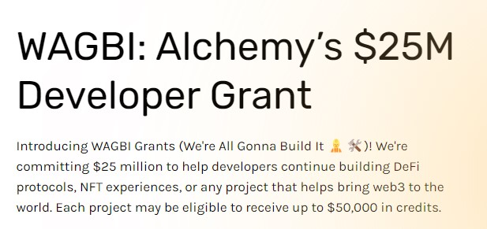

# WEB3 GRANTS

# Hi there 👋

This repository will help you to find web3 grants for your project.

## Alchemy

Alchemy is web3 developer tooling platform and node provider, powering companies like OpenSea, Meta, Shopify, etc.
Their WAGBI program offers developers up to $50,000 in credits.  
  
[Alchemy](https://www.alchemy.com/developer-grant-program)

<!-- | | [NoDesk](https://nodesk.co/remote-jobs/) | -->
